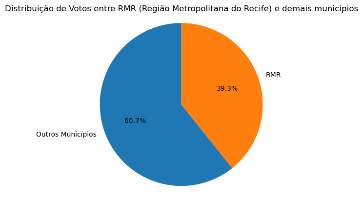
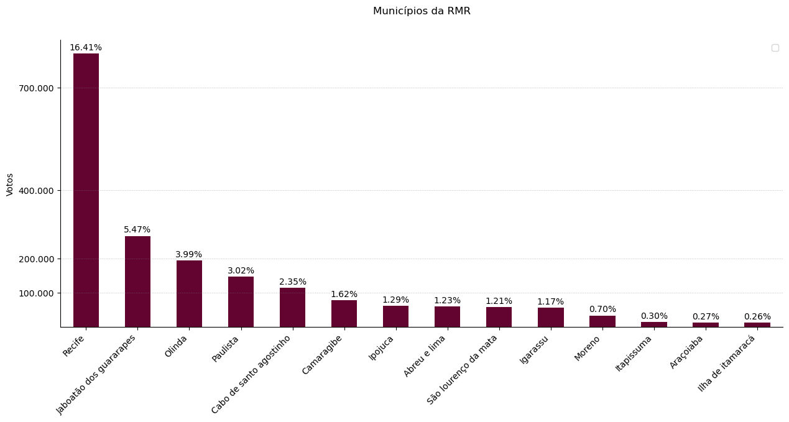
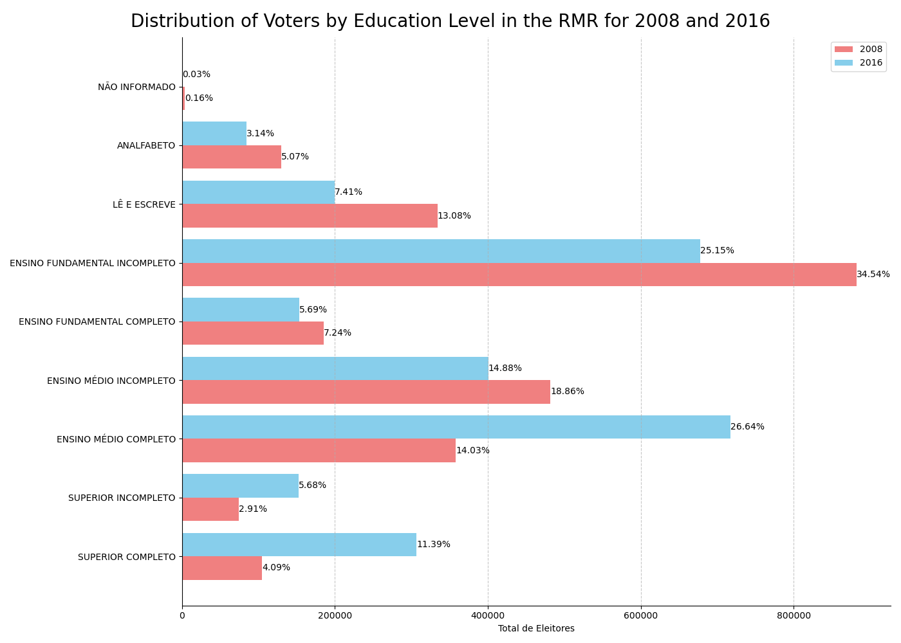
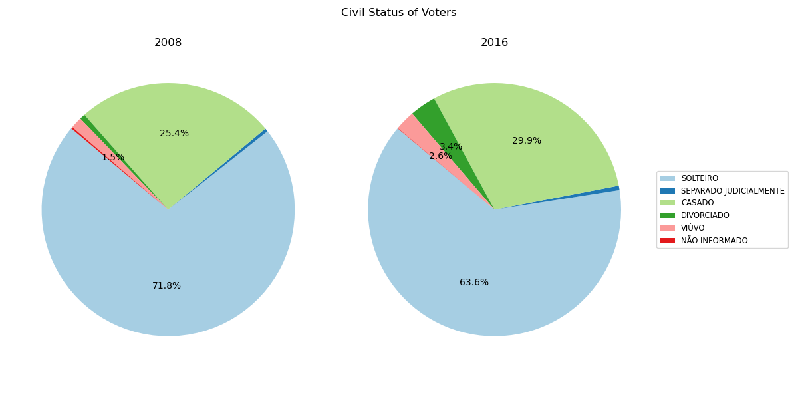
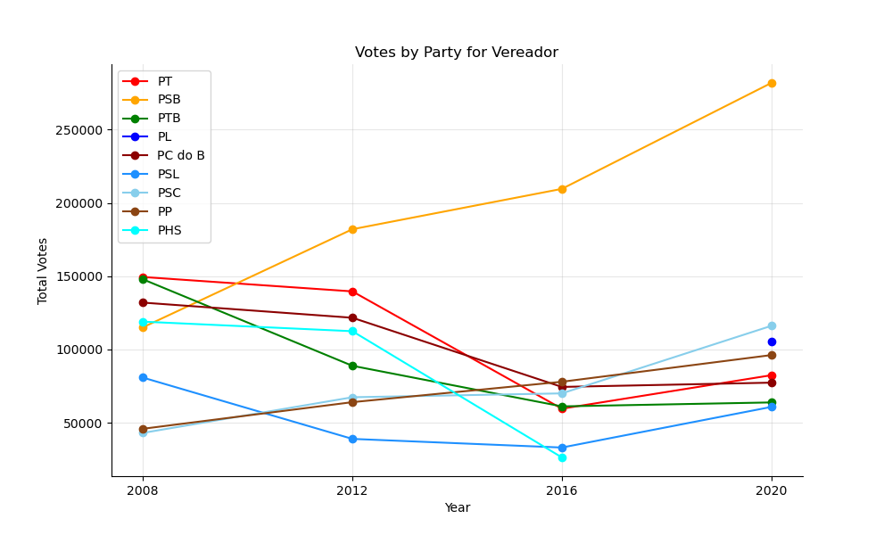
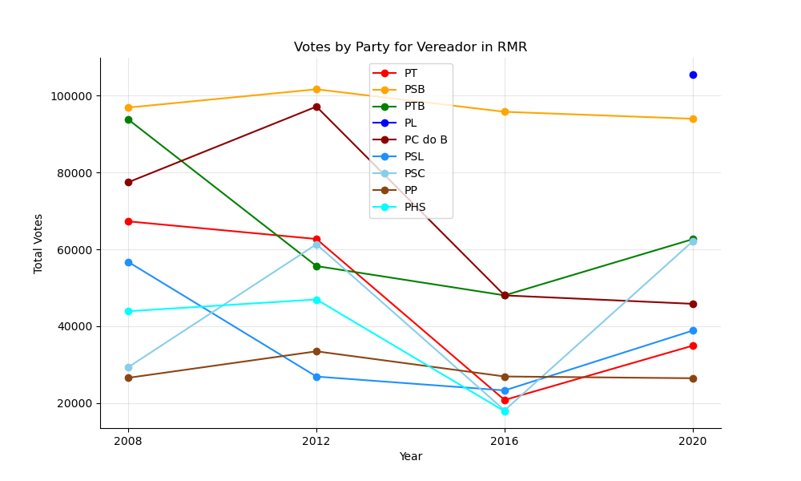
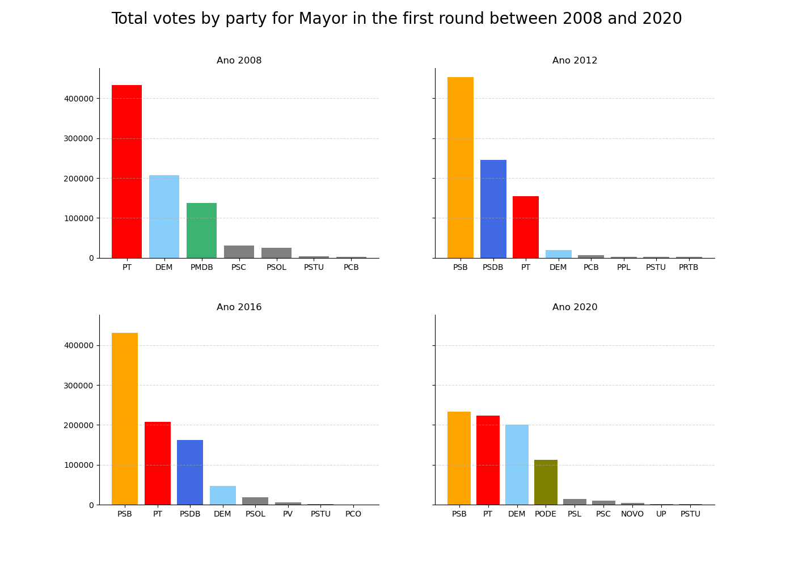

# Análise de Dados Eleitorais de Pernambuco

### Justificativa
O uso de um dataset contendo informações eleitorais estaduais é crucial para uma compreensão aprofundada do processo democrático, permitindo análises de tendências políticas, avaliações do desempenho político, promoção da transparência eleitoral e facilitação da pesquisa acadêmica. 
Esses dados fornecem insights valiosos sobre o comportamento dos eleitores, resultados eleitorais e dinâmicas políticas em nível estadual ao longo do tempo. 
Além disso, eles são essenciais para informar políticas, promover a participação cívica e fortalecer as instituições democráticas, contribuindo para uma sociedade mais informada, engajada e democrática.

### Informações sobre os Datasets
Os datasets foram retirados do site do TSE: https://dadosabertos.tse.jus.br/dataset/

Links para os datasets utilizados:
* https://dadosabertos.tse.jus.br/dataset/resultados-2020/resource/db0b6c75-dc82-48d8-b207-ba2b420ec58a
* https://dadosabertos.tse.jus.br/dataset/resultados-2020/resource/977f5f4a-8d03-4b3d-aaa5-00001b996f02
* https://dadosabertos.tse.jus.br/dataset/resultados-2016/resource/ccd2564b-a576-4c17-a603-31e49f980667
* https://dadosabertos.tse.jus.br/dataset/resultados-2016/resource/888ff43d-9e07-45a0-80cb-9814a38ff74b
* https://dadosabertos.tse.jus.br/dataset/resultados-2012/resource/01f124d9-d4a0-4e96-9d1c-7be06e63adb2
* https://dadosabertos.tse.jus.br/dataset/resultados-2012/resource/3c1314d1-a66a-4d04-bdff-c4ffe37d33e3
* https://dadosabertos.tse.jus.br/dataset/resultados-2008/resource/075f91b8-e61e-437f-91f9-e7be607df5c8
* https://dadosabertos.tse.jus.br/dataset/resultados-2008/resource/539e7e06-55cf-4d57-880d-b4f68fdea936
* https://dadosabertos.tse.jus.br/dataset/eleitorado-2008/resource/4014bc88-3cab-4624-8b38-e84abacbf5c9
* https://dadosabertos.tse.jus.br/dataset/eleitorado-2016/resource/5d4303b1-8a9b-47dd-8f62-74ae5679574f

### Integrantes do grupo
- Bárbara Rodrigues
- Guilherme Guimarães
- Jéssica Almeida
- Luiz Pinheiro
- Mariana Pedrosa
- Naeldy Godoy

## Análises entre 2008 e 2020

Analisamos dados eleitorais nas eleições municipais em Pernambuco entre 2008 e 2020.
Para fazer um recorte em razão de uma análise mais direcionada optamos por focar na Região Metropolitana do Recife (RMR).

A RMR constitui quase que 40% dos votos no Estado de Pernambuco, embora seja apenas 3,3% da área do Estado.

Constituindo-se de 14 dos 185 municípios de Pernambuco, a região concentra-se ao entorno da capital Recife, distoando profundamente dos demais municípios pela sua capacidade demográfica (neste caso eleitoral).

Desde a eleição de 2008 ocorreu um visível modificicação no grau de escolaridade na RMR. 
Em que o número de votantes com ensino fundamental incompleto caiu de 34,54% para 25,15%.
Ao passo que o percentual de votantes com ensino médio completo e superior completo subiu.

Por outro lado, o estado civil dos votantes teve uma pequena alteração com o número de solteiros caindo e o número de divórcios e casamento aumentando.

Outra distinção ao longo dos 12 anos entre as 4 eleições municipais é o crescimento na quantidade de votos nulos e brancos.
No Recife, é possível vislumbrar o aumento e a disparidade para o voto em legenda em terceiro lugar e um voto nominal em quarto.

Com o tempo o cenário político também se modifica, o PSB que tinha uma quantidade de votos dentro de uma uniformidade com outros partidos passou a ser o partido com maior quantidade de votos.
Mostrando-se uma gigantesca disparidade em relação aos demais.

Entretando, ao retirar os votos do Recife na RMR, a quantidade de votos do PSB volta a estar dentro de um padrão com os demais, perdendo até a liderança em 2020.

Por fim, é possível ver um pouco das transformações políticas para eleição de Prefeito no Recife ao longo desses 12 anos, mostrando tanto um cenário que foi do domínio do PSB em 2012 e 2016 a uma concorrêcia mais disputada em 2020.

